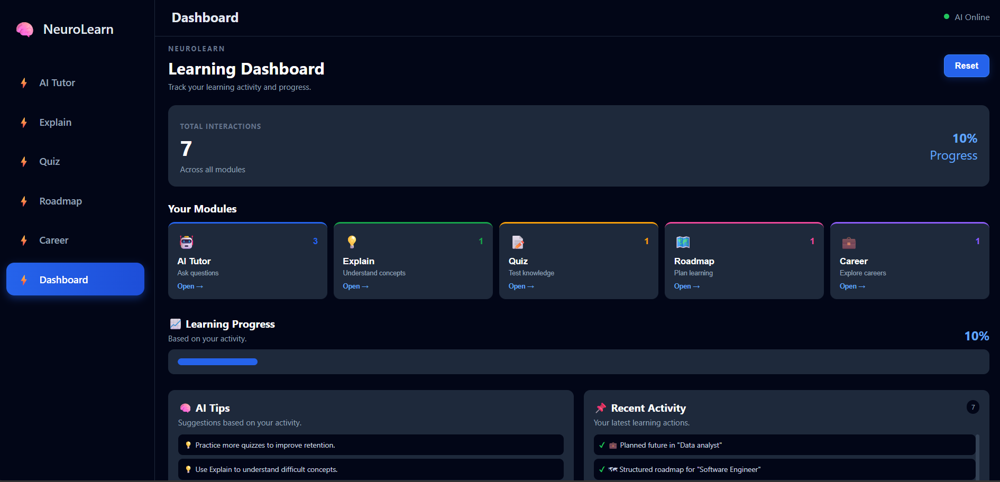
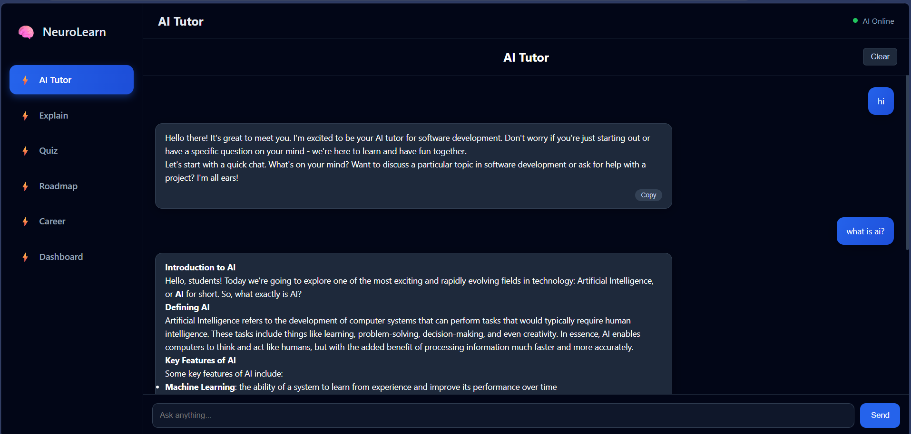
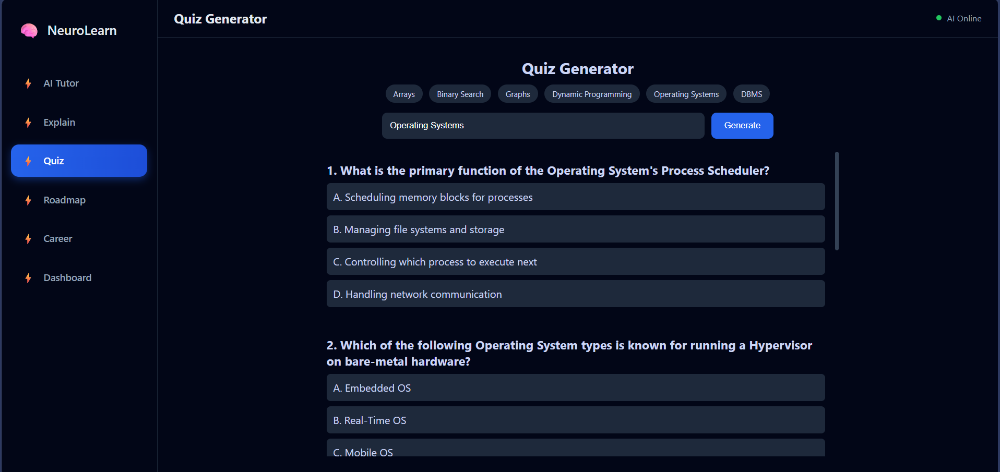
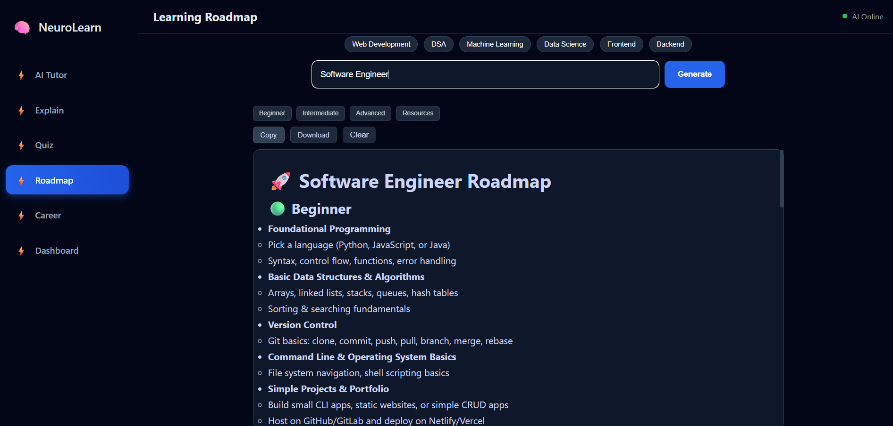
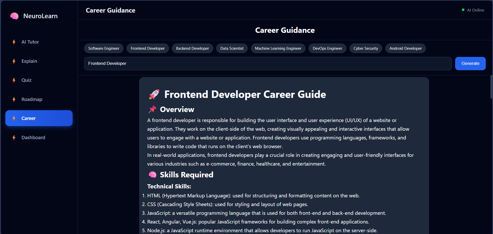

<div align="center">

# 🎓 NeuroLearn AI
### AI-Powered Personalized Learning Assistant

An intelligent full-stack educational platform that leverages Artificial Intelligence to provide personalized tutoring, concept explanations, quiz generation, learning roadmaps, career guidance, and progress tracking—all in one unified application.


</div>

---

# 📖 Overview

NeuroLearn AI is a modern AI-powered learning platform designed to make education more personalized, interactive, and efficient. Instead of relying on multiple websites for tutoring, quizzes, learning roadmaps, and career guidance, NeuroLearn AI combines all these capabilities into a single intelligent application.

The platform uses **React.js** for the frontend, **Node.js + Express.js** for the backend, and **Groq AI API** to generate fast, context-aware educational responses.

---

# ✨ Key Features

- 🤖 AI Tutor for instant question answering
- 📚 AI-powered topic explanations
- 📝 Dynamic quiz generation
- 🛣️ Personalized learning roadmap generation
- 💼 AI Career Guidance
- 📊 Dashboard with activity and usage statistics
- ⚡ Fast AI responses using Groq API
- 🎨 Responsive and modern user interface
- 🔄 Modular and scalable architecture

---

# 🏗️ System Architecture

The application follows a **Three-Tier Architecture**:

```text
Users
   │
   ▼
React Frontend
   │
   ▼
Node.js + Express Backend
   │
   ▼
Groq AI API
   │
   ▼
AI Generated Responses
```

---

# 🚀 Technology Stack

## Frontend
- React.js
- JavaScript (ES6+)
- HTML5
- CSS3
- Axios

## Backend
- Node.js
- Express.js

## AI
- Groq API

## Development Tools
- Git
- GitHub
- VS Code
- Postman

---

## 📂 Project Structure

```text
NeuroLearn-AI/
│
├── client/
│   ├── public/
│   ├── src/
│   │   ├── assets/
│   │   ├── components/
│   │   ├── pages/
│   │   ├── services/
│   │   ├── App.css
│   │   ├── App.jsx
│   │   ├── index.css
│   │   └── main.jsx
│   │
│   ├── .gitignore
│   ├── README.md
│   ├── eslint.config.js
│   ├── index.html
│   ├── package.json
│   ├── package-lock.json
│   └── vite.config.js
│
├── server/
│   ├── services/
│   │   └── aiService.js
│   ├── server.js
│   ├── package.json
│   ├── package-lock.json
│   ├── .gitignore
│   └── README.md
│
├── assets/
│   ├── architecture.png
│   ├── dashboard.png
│   ├── quiz.png
│   ├── roadmap.png
│   └── career.png
│
├── .gitignore
├── LICENSE
└── README.md
```

# ⚙️ Installation

## Clone Repository

```bash
git clone https://github.com/YOUR_USERNAME/NeuroLearn-AI.git
cd NeuroLearn-AI
```

---

## Install Frontend

```bash
cd client
npm install
npm start
```

---

## Install Backend

```bash
cd server
npm install
npm run dev
```

---

## Environment Variables

Create a `.env` file inside the server directory.

```env
GROQ_API_KEY=your_api_key_here
PORT=5000
```

---

# 💻 Usage

1. Start the backend server.
2. Start the React frontend.
3. Open your browser.

```
http://localhost:3000
```

Select any module such as:

- AI Tutor
- Explain Topic
- Quiz Generator
- Roadmap Planner
- Career Guidance

Enter your query and receive AI-generated responses.

---

# 📸 Screenshots

## Dashboard



---

## AI Tutor



---

## Quiz Generator



---

## Learning Roadmap



---

## Career Guidance



---

# 🔄 Application Workflow

1. User selects a module.
2. User enters a topic or question.
3. Frontend sends request to backend.
4. Backend processes the request.
5. Backend communicates with Groq AI API.
6. AI generates personalized content.
7. Response is displayed on the frontend.
8. Dashboard updates activity statistics.

---

# 📌 Modules

| Module | Description |
|---------|-------------|
| AI Tutor | Answers academic questions using AI |
| Explain | Generates simplified explanations |
| Quiz Generator | Creates topic-based quizzes |
| Roadmap Planner | Builds structured learning paths |
| Career Guidance | Provides career recommendations |
| Dashboard | Displays activity statistics |

---

# 🎯 Project Highlights

- Full-Stack AI Application
- Component-Based React Architecture
- RESTful API Design
- AI-Powered Educational Platform
- Personalized Learning Experience
- Responsive UI
- Modular Backend
- Scalable Project Structure

---

# 🌍 SDG Alignment

This project contributes to:

### **SDG 4 – Quality Education**

NeuroLearn AI promotes accessible, personalized, and technology-driven education by helping learners understand concepts, assess knowledge, plan learning paths, and explore career opportunities.

---

# 🔮 Future Scope

- User Authentication
- MongoDB Integration
- Voice-Based AI Tutor
- AI Resume Builder
- Coding Compiler
- Placement Interview Preparation
- Learning Analytics
- Mobile Application
- Multi-language Support
- Cloud Deployment

---

# 🤝 Contributing

Contributions are welcome.

1. Fork the repository
2. Create a feature branch

```bash
git checkout -b feature-name
```

3. Commit your changes

```bash
git commit -m "Add feature"
```

4. Push to GitHub

```bash
git push origin feature-name
```

5. Create a Pull Request

---

# 📜 License

This project is licensed under the **MIT License**.

---

# 👨‍💻 Author

**Dixant Soni**

- 🎓 B.Tech CSE (AI & Data Science)
- Indian Institute of Information Technology Manipur
- Passionate about Software Engineering, Artificial Intelligence, and Full-Stack Development

### GitHub

https://github.com/DIXANTOFFICIAL1

---

<div align="center">

### ⭐ If you found this project useful, consider giving it a star!

**Building intelligent solutions for smarter learning. 🚀**

</div>
